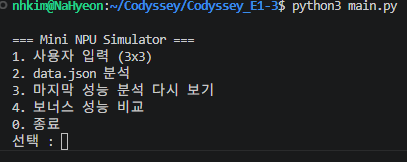
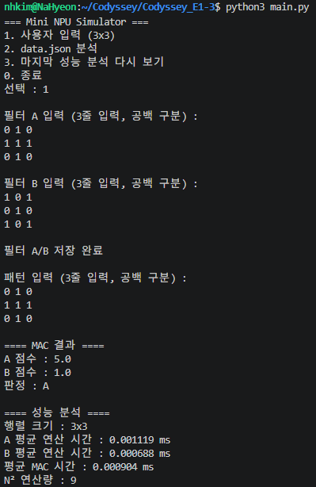
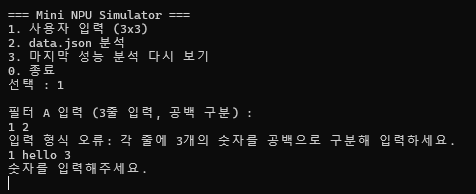
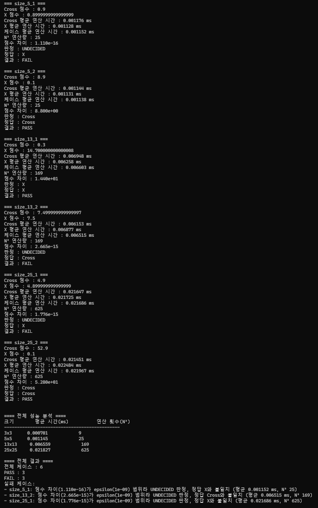
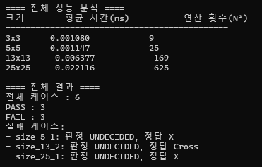
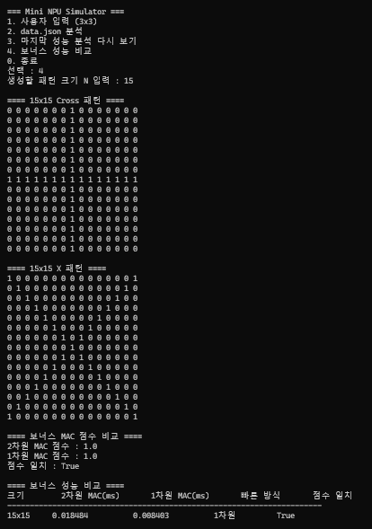

# Mini NPU Simulator

Python 반복문으로 MAC(Multiply-Accumulate) 연산을 직접 구현하고, 입력 패턴과 필터의 점수를 비교해 패턴을 판정하는 콘솔 기반 Mini NPU 시뮬레이터입니다.

외부 수치 연산 라이브러리 없이 Python 표준 라이브러리만 사용했으며, 3x3, 5x5, 13x13, 25x25 행렬의 MAC 연산 시간과 N^2 연산량을 비교합니다.

---

# 1. 프로젝트 목적

MAC 연산은 같은 위치에 있는 두 값을 곱하고 그 결과를 계속 더하는 연산입니다.

```text
Multiply   : 같은 위치의 값을 곱한다
Accumulate : 곱한 결과를 누적해서 더한다
```

NPU는 AI 연산에서 반복되는 많은 MAC 연산을 빠르게 처리하기 위해 사용됩니다. 이번 프로젝트에서는 실제 NPU 하드웨어를 구현하는 것이 아니라, Python으로 MAC 연산을 직접 구현하면서 다음 내용을 확인합니다.

- 입력 패턴과 필터를 숫자 행렬로 표현하는 방법
- 위치별 곱셈과 누적을 통해 MAC Score를 계산하는 원리
- Cross/X 필터 점수를 비교해 패턴을 판정하는 방식
- 행렬 크기가 커질수록 연산량이 N^2로 증가하는 이유
- 부동소수점 오차와 epsilon 기반 비교 정책이 필요한 이유

---

# 2. 실행 방법

## 2.1 실행 환경

- Python 3.8 이상
- 외부 라이브러리 사용 없음
- 사용한 표준 라이브러리
  - `json`
  - `time`

프로젝트 폴더에서 실행합니다.

```bash
python main.py
```

실행하면 다음 메뉴가 표시됩니다.

```text
=== Mini NPU Simulator ===
1. 사용자 입력 (3x3)
2. data.json 분석
3. 마지막 성능 분석 다시 보기
4. 보너스 성능 비교
0. 종료
```



---

# 3. 사용자 입력 모드

메뉴에서 `1`을 선택하면 3x3 필터 A, 3x3 필터 B, 3x3 패턴을 직접 입력합니다.

각 행은 숫자 3개를 공백으로 구분해 입력합니다.

```text
0 1 0
1 1 1
0 1 0
```

입력 흐름은 다음과 같습니다.

```text
필터 A 입력
    -> 필터 B 입력
    -> 필터 A/B 저장 완료
    -> 저장된 필터 A/B 출력
    -> 패턴 입력
    -> MAC 점수 계산
    -> A / B / UNDECIDED 판정
    -> 3x3 성능 분석 출력
```

사용자 입력 모드에서는 다음 값을 출력합니다.

- A 점수
- B 점수
- 판정 결과
- A 평균 연산 시간(ms)
- B 평균 연산 시간(ms)
- 평균 MAC 시간(ms)
- N^2 연산량



## 3.1 입력 검증

입력 행의 숫자 개수가 부족하거나 많으면 다시 입력받습니다.

```text
입력 형식 오류: 각 줄에 3개의 숫자를 공백으로 구분해 입력하세요.
```

숫자가 아닌 값을 입력한 경우도 다시 입력받습니다.

```text
숫자를 입력해주세요.
```



---

# 4. JSON 분석 모드

메뉴에서 `2`를 선택하면 `data.json`을 읽어 여러 테스트 케이스를 자동으로 분석합니다.

`data.json`의 주요 구조는 다음과 같습니다.

```text
filters
    ├── size_5
    ├── size_13
    └── size_25

patterns
    ├── size_5_1
    ├── size_5_2
    ├── size_13_1
    ├── size_13_2
    ├── size_25_1
    └── size_25_2
```

패턴 key는 `size_{N}_{index}` 형식입니다. 예를 들어 `size_13_2`는 N이 13이라는 뜻이므로 `filters`의 `size_13` 필터를 사용합니다.

JSON 분석 흐름은 다음과 같습니다.

```text
data.json 로드
    -> filters / patterns 존재 확인
    -> 3x3 기준 성능 측정
    -> pattern key에서 N 추출
    -> N에 맞는 filter 선택
    -> filter key 라벨 정규화
    -> expected 라벨 정규화
    -> 패턴 / 필터 크기 검증
    -> Cross / X MAC 계산
    -> Cross / X / UNDECIDED 판정
    -> expected와 비교해 PASS / FAIL 출력
    -> 3x3 / 5x5 / 13x13 / 25x25 성능표 출력
    -> 전체 테스트 결과 요약 출력
```



---

# 5. 구현 요약

주요 함수는 역할별로 분리했습니다.

| 구분 | 함수 |
|---|---|
| JSON 로드 | `load_json_data()` |
| MAC 계산 | `calculate_mac()` |
| 행렬 검증 | `validate_matrix()`, `validate_same_size()`, `validate_case_matrices()` |
| 사용자 입력 | `input_matrix()` |
| 라벨 정규화 | `normalize_label()`, `normalize_filters()` |
| pattern key 처리 | `extract_pattern_size()` |
| 판정 | `decide_pattern()` |
| 성능 측정 | `measure_performance()`, `analyze_performance()` |
| 결과 출력 | `show_user_result()`, `show_case_result()`, `show_test_summary()`, `show_performance_results()` |
| 보너스 | `flatten_matrix()`, `calculate_mac_flat()`, `generate_cross_pattern()`, `generate_x_pattern()` |

함수를 나눈 이유는 계산, 검증, 판정, 출력, 성능 측정을 서로 독립적으로 관리하기 위해서입니다. 예를 들어 `calculate_mac()`은 점수 계산만 담당하고, `measure_performance()`는 실행 시간 측정만 담당합니다.

---

# 6. MAC 연산 구현

MAC는 같은 위치에 있는 값을 곱하고 그 결과를 모두 더합니다.

```text
Pattern          Filter

1  2             5  6
3  4             7  8
```

계산 과정은 다음과 같습니다.

```text
(1 * 5) + (2 * 6) + (3 * 7) + (4 * 8) = 70
```

코드에서는 외부 라이브러리 없이 반복문으로 직접 구현했습니다.

```python
score = 0.0
size = len(pattern)

for row in range(size):
    for col in range(size):
        score += pattern[row][col] * filter_data[row][col]
```

---

# 7. 데이터 검증

MAC 연산 전에는 패턴과 필터가 정상적인 N x N 행렬인지 확인합니다.

정상적인 3x3 행렬은 모든 행에 3개의 값이 있어야 합니다.

```text
1 0 1
0 1 0
1 0 1
```

다음처럼 행마다 열 개수가 다르면 정상적인 N x N 행렬이 아닙니다.

```text
1 0
0 1 0
1 0 1
```

검증은 두 단계로 나누었습니다.

1. `validate_matrix()`로 행렬 자체가 N x N인지 확인
2. `validate_same_size()`로 패턴과 필터 크기가 서로 같은지 확인

JSON 모드에서는 pattern key의 N과 실제 행렬 크기가 같은지도 확인합니다. 크기나 스키마가 잘못된 케이스는 프로그램을 종료하지 않고 해당 케이스만 FAIL로 기록합니다.

---

# 8. 라벨 정규화

프로그램 내부 표준 라벨은 다음 두 가지입니다.

```text
Cross
X
```

하지만 `data.json`에서는 같은 의미가 서로 다른 문자열로 표현됩니다.

```text
filter key : cross, x
expected   : +, x
```

따라서 비교 전에 다음 규칙으로 정규화합니다.

| 외부 데이터 | 내부 표준 |
|---|---|
| `+` | `Cross` |
| `cross` | `Cross` |
| `Cross` | `Cross` |
| `x` | `X` |
| `X` | `X` |

정규화를 하지 않으면 의미상 같은 값이어도 문자열 비교에서 실패할 수 있습니다.

```python
"Cross" == "+"  # False
```

정규화를 적용하면 PASS/FAIL 비교는 항상 `Cross`, `X` 기준으로 수행됩니다.

---

# 9. epsilon과 부동소수점 비교

두 MAC 점수의 차이가 매우 작으면 동점으로 보고 `UNDECIDED`를 반환합니다.

```python
abs(score_a - score_b) < 1e-9
```

`abs()`를 사용하는 이유는 점수 차이가 음수로 나올 수 있기 때문입니다. 동점 판정에서 중요한 것은 어느 값이 앞에 있느냐가 아니라 두 점수 사이의 거리입니다.

Python의 `float`는 실수를 2진수 근삿값으로 저장합니다. 그래서 수학적으로 같은 값이어도 아주 작은 오차가 생길 수 있습니다.

```python
0.1 + 0.2
# 0.30000000000000004
```

이번 프로젝트에서는 이런 미세한 차이 때문에 Cross 또는 X가 잘못 선택되는 것을 막기 위해 `EPSILON = 1e-9`를 사용했습니다.

## 9.1 과학적 표기법

실패 사유의 점수 차이는 매우 작은 값이므로 과학적 표기법으로 출력합니다.

```text
1.110e-16 = 1.110 x 10^-16
1e-9      = 1 x 10^-9 = 0.000000001
```

예를 들어 다음 출력은 실제 점수 차이가 epsilon보다 훨씬 작아서 동점으로 처리되었다는 뜻입니다.

```text
점수 차이(1.110e-16)가 epsilon(1e-09) 범위라 UNDECIDED 판정
```

---

# 10. JSON 테스트 결과

JSON 분석 모드에서는 각 케이스마다 Cross 점수, X 점수, 판정, 정답, PASS/FAIL을 출력합니다.

| Case | Cross Score | X Score | Decision | Expected | Result |
|---|---:|---:|---|---|---|
| `size_5_1` | 0.9 | 0.8999999999999999 | UNDECIDED | X | FAIL |
| `size_5_2` | 8.9 | 0.1 | Cross | Cross | PASS |
| `size_13_1` | 0.3 | 14.700000000000008 | X | X | PASS |
| `size_13_2` | 7.499999999999997 | 7.5 | UNDECIDED | Cross | FAIL |
| `size_25_1` | 4.9 | 4.899999999999999 | UNDECIDED | X | FAIL |
| `size_25_2` | 52.9 | 0.1 | Cross | Cross | PASS |

전체 결과는 다음과 같습니다.

```text
전체 케이스 : 6
PASS : 3
FAIL : 3
```

실패 케이스는 케이스 식별자와 실패 사유를 함께 출력합니다.

```text
실패 케이스:
- size_5_1: 점수 차이(1.110e-16)가 epsilon(1e-09) 범위라 UNDECIDED 판정, 정답 X와 불일치
- size_13_2: 점수 차이(2.665e-15)가 epsilon(1e-09) 범위라 UNDECIDED 판정, 정답 Cross와 불일치
- size_25_1: 점수 차이(1.776e-15)가 epsilon(1e-09) 범위라 UNDECIDED 판정, 정답 X와 불일치
```

---

# 11. 성능 측정 결과

성능 측정에는 `time.perf_counter()`를 사용했습니다. 측정 구간에는 입력, 출력, JSON 파일 읽기 시간을 포함하지 않고 MAC 연산 함수 호출 시간만 포함합니다.

각 MAC 연산은 최소 10회 반복한 뒤 평균 시간을 계산합니다.

```text
측정 시작
    -> calculate_mac() 10회 반복
    -> 측정 종료
    -> 총 실행 시간 / 10
    -> ms 단위 변환
```

최근 실행 예시는 다음과 같습니다. 실행 시간은 환경에 따라 달라질 수 있습니다.

| 행렬 크기 | 평균 MAC 시간(ms) | N^2 연산량 |
|---|---:|---:|
| 3x3 | 0.000795 | 9 |
| 5x5 | 0.001310 | 25 |
| 13x13 | 0.006756 | 169 |
| 25x25 | 0.022392 | 625 |



---

# 12. 결과 리포트

아래 내용은 실패 원인 분석과 시간 복잡도 분석을 함께 정리한 결과 리포트입니다.

1. 이 프로그램은 Python 반복문으로 MAC 연산을 직접 구현했다.
2. JSON 분석 모드에서는 `data.json`의 6개 패턴을 Cross/X 필터와 비교했다.
3. 전체 테스트 결과는 PASS 3개, FAIL 3개로 확인되었다.
4. 실패 케이스는 `size_5_1`, `size_13_2`, `size_25_1`이다.
5. 세 실패 케이스는 데이터 로드 실패나 스키마 오류 때문에 실패한 것이 아니다.
6. 세 실패 케이스는 Cross 점수와 X 점수 차이가 epsilon 범위 안에 들어가 `UNDECIDED`로 판정되었기 때문에 실패했다.
7. `size_5_1`은 `UNDECIDED`로 판정되었지만 expected가 `X`라서 FAIL이다.
8. `size_13_2`는 `UNDECIDED`로 판정되었지만 expected가 `Cross`라서 FAIL이다.
9. `size_25_1`은 `UNDECIDED`로 판정되었지만 expected가 `X`라서 FAIL이다.
10. 라벨 정규화는 정상적으로 적용되어 `+`, `cross`, `x` 표현 차이로 인한 실패는 발생하지 않았다.
11. 만약 실패가 0개라면 라벨 정규화가 정상적으로 적용되고, epsilon 정책도 expected와 충돌하지 않는 방식으로 동작했다고 해석할 수 있다.
12. MAC 함수는 N x N 행렬의 모든 위치를 한 번씩 순회한다.
13. 바깥 반복문이 N번, 안쪽 반복문이 N번 실행되므로 전체 연산 횟수는 N^2이다.
14. 3x3, 5x5, 13x13, 25x25의 연산 횟수는 각각 9, 25, 169, 625이다.
15. 따라서 현재 MAC 구현의 시간 복잡도는 O(N^2)이다.
16. N이 커질수록 연산량은 선형이 아니라 제곱으로 증가한다.
17. 실제 실행 시간도 행렬 크기가 커질수록 증가하는 경향을 보인다.
18. 다만 실제 시간은 Python 인터프리터, CPU 상태, 운영체제 스케줄링의 영향을 받기 때문에 N^2 비율과 완전히 같지는 않다.

---

# 13. 시간 복잡도 분석

MAC 구현은 이중 반복문 구조입니다.

```python
for row in range(size):
    for col in range(size):
        score += pattern[row][col] * filter_data[row][col]
```

따라서 N x N 행렬의 MAC 연산량은 다음과 같습니다.

```text
N * N = N^2
```

| 행렬 크기 | N^2 |
|---|---:|
| 3x3 | 9 |
| 5x5 | 25 |
| 13x13 | 169 |
| 25x25 | 625 |

시간 복잡도는 다음과 같습니다.

```text
O(N^2)
```

---

# 14. 예외 처리

프로그램이 잘못된 입력 하나 때문에 종료되지 않도록 다음 상황을 처리합니다.

## 14.1 사용자 입력

- 한 행의 숫자 개수가 부족한 경우
- 한 행의 숫자 개수가 많은 경우
- 숫자가 아닌 값을 입력한 경우

## 14.2 JSON 분석

- `data.json` 파일이 없는 경우
- JSON 형식이 잘못된 경우
- `filters` 또는 `patterns`가 없는 경우
- 패턴에 `input` 또는 `expected`가 없는 경우
- pattern key 형식이 잘못된 경우
- 해당 크기의 필터가 없는 경우
- Cross 또는 X 필터가 없는 경우
- 패턴 또는 필터가 N x N 행렬이 아닌 경우
- 패턴과 필터 크기가 다른 경우
- pattern key의 N과 실제 행렬 크기가 다른 경우

## 14.3 메뉴 입력

메뉴에서 `0`, `1`, `2`, `3`, `4`가 아닌 값을 입력하면 다음 메시지를 출력하고 메뉴를 다시 보여줍니다.

```text
올바른 값을 입력하세요.
```

---

# 15. 보너스 구현

선택 과제로 1차원 배열 기반 MAC 비교와 패턴 생성기를 구현했습니다.

## 15.1 1차원 배열 기반 MAC 비교

기본 MAC 함수는 2차원 리스트를 사용합니다.

```python
pattern[row][col]
filter_data[row][col]
```

보너스에서는 N x N 행렬을 N^2 길이의 1차원 리스트로 변환한 뒤 MAC을 계산합니다.

```python
flatten_matrix(matrix)
calculate_mac_flat(pattern_flat, filter_flat)
```

두 방식은 데이터 표현만 다르고 같은 위치의 값을 곱해 누적한다는 MAC 원리는 같습니다. 보너스 모드에서는 두 방식의 점수가 일치하는지도 확인합니다.

## 15.2 패턴 생성기

메뉴에서 `4`를 선택하고 크기 N을 입력하면 N x N Cross 패턴과 X 패턴을 자동 생성합니다.

```text
생성할 패턴 크기 N 입력 : 5
```

보너스 모드는 생성된 패턴을 사용해 2차원 MAC과 1차원 MAC의 성능을 비교합니다.



---

# 16. 구현 체크리스트

- [x] Python 표준 라이브러리만 사용
- [x] 3x3 사용자 입력 기능 구현
- [x] 입력 행/열 개수 검증
- [x] 숫자 파싱 실패 시 재입력 유도
- [x] MAC 연산 반복문 직접 구현
- [x] A / B / UNDECIDED 판정 구현
- [x] `data.json` 로드 구현
- [x] pattern key에서 N 추출
- [x] N에 맞는 filter 선택
- [x] N x N 행렬 검증
- [x] 패턴과 필터 크기 일치 검증
- [x] 라벨 정규화 구현
- [x] epsilon 기반 동점 처리
- [x] Cross / X / UNDECIDED 판정 구현
- [x] PASS / FAIL 출력 구현
- [x] 실패 케이스 식별자와 실패 사유 출력
- [x] MAC 10회 반복 평균 시간 측정
- [x] 3x3 / 5x5 / 13x13 / 25x25 성능표 출력
- [x] 결과 리포트 10줄 이상 작성
- [x] O(N^2) 시간 복잡도 분석
- [x] 보너스 1차원 배열 MAC 비교 구현
- [x] 보너스 Cross/X 패턴 생성기 구현

---

# 17. 제출 전 확인

1. `python main.py` 실행 확인
2. 사용자 입력 모드 캡처 확인
3. JSON 분석 모드 캡처 확인
4. 전체 성능표 캡처 확인
5. 입력 검증 캡처 확인
6. 보너스 실행 결과 캡처 확인
7. `main.py`, `data.json`, `README.md`, `images/` 폴더 함께 제출
